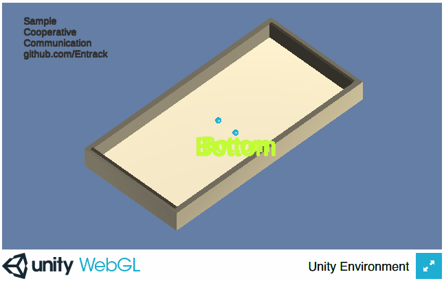

# [github.io demo link](https://www.google.com)  
This is a simple scenario of two agents communicating in order to go in the right direction.  
At the start of every round one of the agents has a knowledge of which of the sides will reward or penalize when reached.  

