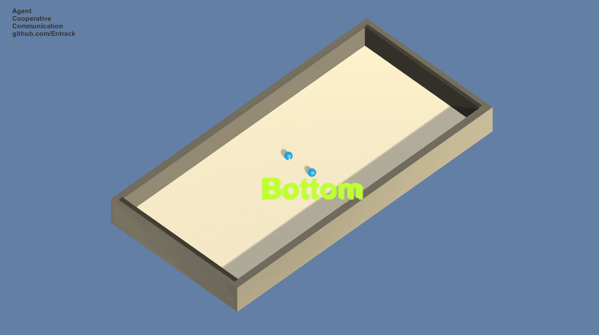
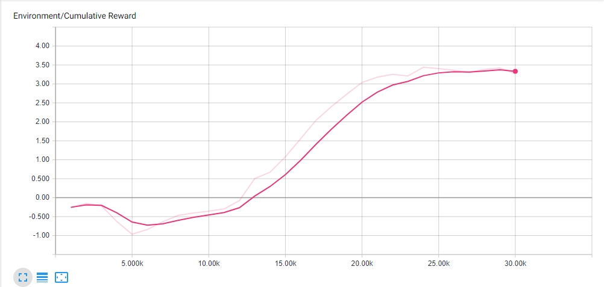

# Agent Cooperative Communication
This repo contains the demo Unity3D project that tackles the task of double agent communication using Reinforcement Learning.  
This is a double-agent setup with one randomly chosen to know the correct side of the field agents should go to. Although the agent is penalized for communicating with another agent, he gets a reward for them both surviving. The result demonstrates that the agents select to communicate, thus increasing the total reward.  

**The WebGL live version is avaliable [here](https://entrack.github.io/agent-cooperative-communication/).**  

### Environment
The double-sided corridor's upper and bottom walls are randomly selected to be either rewarding or penalizing. The agent gets rewarded or penalized every time it touches the wall. Every agent also shares the reward of another one, and he is penalized for the speech.  
Agents have some kind of substitute of a short memory in way of repeating the last speech input {0, 1} it got to itself. Here we use the span of 32 iterations.  

### Training
The training was performed using the ML-Agents implementation of the PPO algorithm. As you can see from the illustration below, cumulative reward stops increasing and agent converges while reaching the maximum possible value at 35k iterations.  
